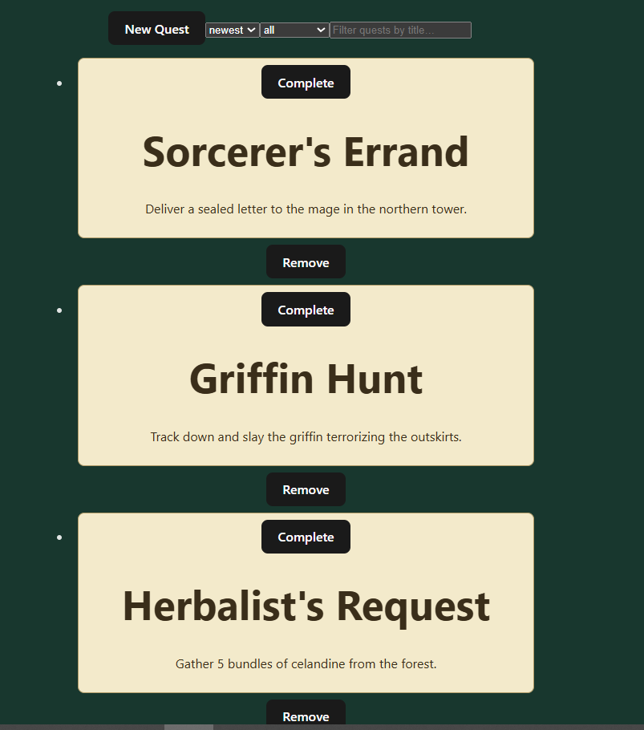
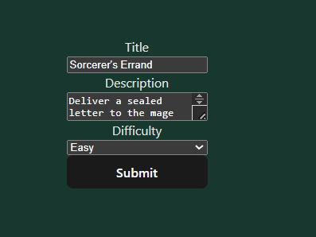
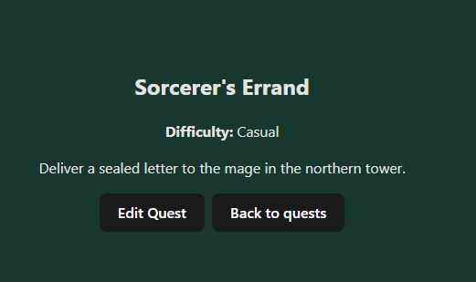

# Quest Board

Quest Board is a small React + TypeScript application for tracking quests.  
You can create, edit, delete and complete quests, and filter or sort them from the main board.

Data is persisted in `localStorage`, so your quests remain after refresh.

---

## Features

- Add new quests (title, description, difficulty)
- Edit existing quests
- Mark quests as completed / uncompleted
- Delete quests
- Search quests by title
- Filter by status (all / active / completed)
- Sort by newest / oldest
- View quest details on a separate page
- Local storage persistence
- Basic routing with `react-router-dom`

---

## Screenshots

**Home (Quest List)**  


**Create / Edit Quest Form**  


_(Optional)_  
**Quest Details**  


---

## Tech Stack

- React
- TypeScript
- Vite
- React Router
- LocalStorage for persistence

---

## Running Locally

Clone the repository:

```bash
git clone https://github.com/LiviuVisovan/quest-board.git
```
